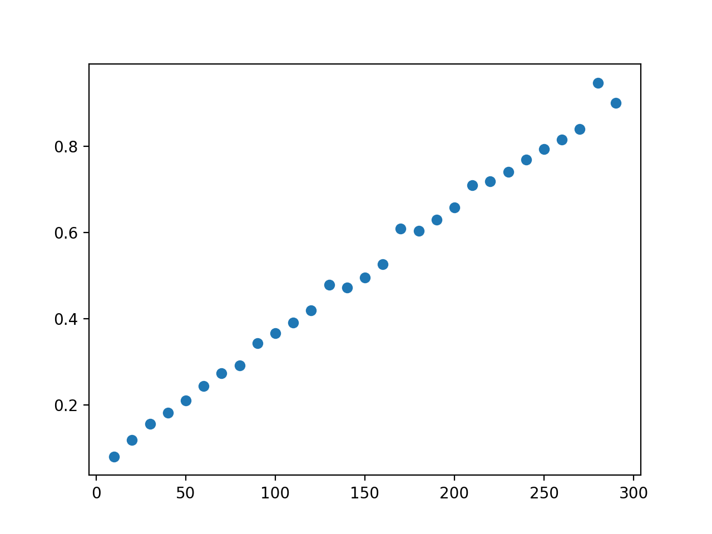

# Memoria de la práctica de Algoritmica y Complejidad
##### Autores: Ramon Escoda Semís, Marc Godia Calderó

## Índice 
1. Introducción
2. Algoritmo Greedy
3. Backtraking

## 1. Introducción 
En este documento vamos a analizar los costes de las implementaciones del algoritmo utilizados para encontrar la opcion optima del acueducto.  


## 2. Algoritmo Greedy
En este apartado veremos como se puede obtener un acueducto con coste optimo o cerano a el mediante el algoritmo voraz siguiente:
```
function find_best_aqueducte_greedy(aqueducte):
    points  <- aqueducte['points']
    height  <-  aqueducte['height']
    alpha   <-  aqueducte['alpha']
    beta    <-  aqueducte['beta']
    
    best_option <- [points[0], points[-1]] # Opcion inicial
    best_cost <- cost(best_option)
        for column in points[1:-1]:
        # Añade la columana para ver si el coste mejora
        best_option.insert(-1, column)    
        cost = calculate_cost(best_option, height, alpha, beta)
        if(cost < best_cost) and is_possible(best_option):            
            best_cost = cost
        else:
            # Si no es mas optimo vuelve a tomar como mejor opcion la anterior
            best_option.remove(column)
    if not_posible(best_option):
        return None, None
    return best_option, best_cost     
```
Como se puede observar el algoritmo busca la solución probando de forma secuencial si para la opcion actual mejora al añadir cada columna,
con el fin de ir actualizando el coste forma local con el fin de llegar la opción optima global.

Puesto que este algoritmo realiza la operación en una sola pasada a la lista de puntos podemos decir que el coste del algoritmo es.
```
O(n)
```
### Coste experimental de la versión iteratica

Como se observa el coste experiemtal es similar al teorico, con algun pico devido sobre todo a la carga de trabajo que tenga la CPU.

## 3. Backtraking
Para la obtención del puente con coste menor coste mediante el uso de bactraking se ha utilizado el algoritmo siguiente:
```
function find_best_aqueducte_backytraking(aqueducte):
    points  <- aqueducte['points']
    height  <-  aqueducte['height']
    alpha   <-  aqueducte['alpha']
    beta    <-  aqueducte['beta']
    # Inicializa la mejor opcion como los 2 extremos del aqueducto
    best_option <- (points[0], points[-1])
    options_stack <- [(0, len(points)-1)]
    # Calcula coste inicial
    if not is_possible(best_option):
        best_cost <- -1
    else:
        best_cost <- calculate_cost(best_option)
    # Genera todas las posibles combinaciones
    # Mientras queden elementos en la pila genera combinaciones
    while options_stack not Empty:
        # Genera todas las combinaciones posibles a partir de la opcion actual
        current_option <- options_stack.pop()
        # Calcula el coste
        option <- generate_option(current_option, points)
        cost = calculate_cost(option)
        if (cost < best_cost or best_cost == -1) and is_possible(option):
            best_option <- option
            best_cost <- cost
        max_value <- max(current_option[:-1])
        for i in range(max_value + 1, len(points) - 1):
            new_option <- list(current_option)
            new_option.insert(len(current_option) - 1, i)
            options_stack.append(tuple(new_option))
    if best_cost == -1:
        return None, None
    return best_option, best_cost
```
Como se puede observar el algoritmo ha de generar todas las posibles combinaciones
de las columnas internas del acueducto, ademas como las combinaciones son representadas por los indices
de los puntos, se ha de descodificar cada combinación lo cual tiene un coste de n, por lo tanto el coste del algoritmo es: 
```
O(n * 2 ^ (n-2))
```
